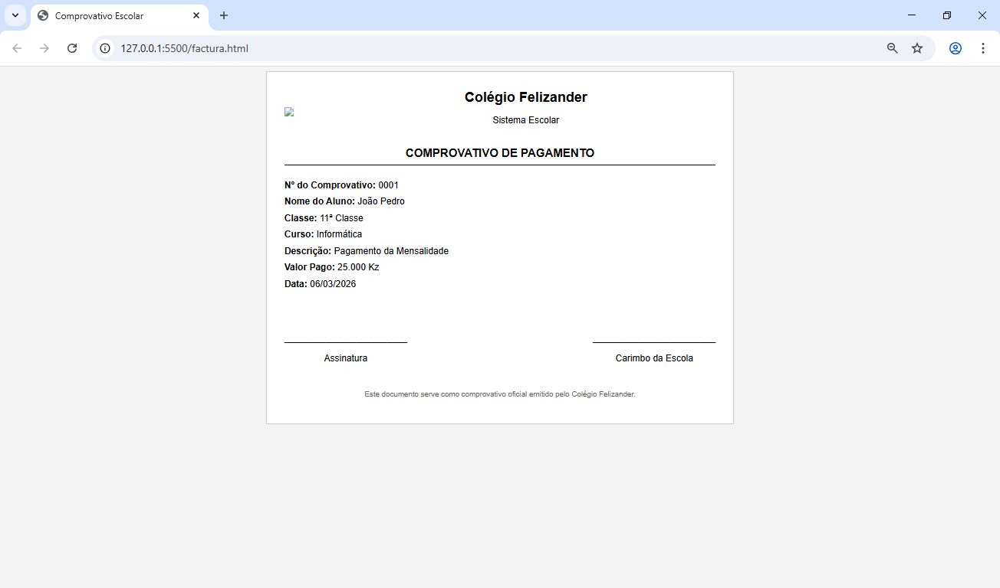

# Sistema de criação de fatura ou comprovante com o php

**Esse exemplo foi criado para um sitema escolar**

O exemplo é feito com PHP (lib DomPDF) , HTML e CSS o exemplo mostra um comprovantivo para ilustrar como projeto funciona :
  

## Recomendações
- Servidor PHP (Xampp ou um outro )
- Modelo da fatura ou comprovativo feito com html e css
- Baixar a biblioteca DomPDF

## para testar o código é necessário baixar a biblioteca DomPdf

### Instalar com Composer

Para instalar com o [Composer](https://getcomposer.org/), basta requerer a versão mais recente deste pacote:

```bash
composer require dompdf/dompdf
```

Certifica-te de que o ficheiro de autoload do Composer está carregado:

```php
// em algum lugar no início do carregamento do teu projecto, inclui o autoloader do Composer
// ver: http://getcomposer.org/doc/00-intro.md
require 'vendor/autoload.php';
```

### Download e instalação manual

Descarrega um arquivo empacotado do dompdf e extrai-o para o directório onde o dompdf irá residir:

- Podes descarregar cópias estáveis do dompdf em https://github.com/dompdf/dompdf/releases
- Ou descarregar uma versão nocturna (o código mais recente, ainda não publicado) em http://eclecticgeek.com/dompdf

Utiliza o autoloader do pacote publicado para carregar o dompdf, as bibliotecas e as funções auxiliares no teu PHP:

```php
// incluir autoloader
require_once 'dompdf/autoload.inc.php';
```

## Ultimas Recomendações

**se não conseguir compreender o codigo visite o GITHUB oficial da biblioteca**,
Link : https://github.com/dompdf/dompdf.git
